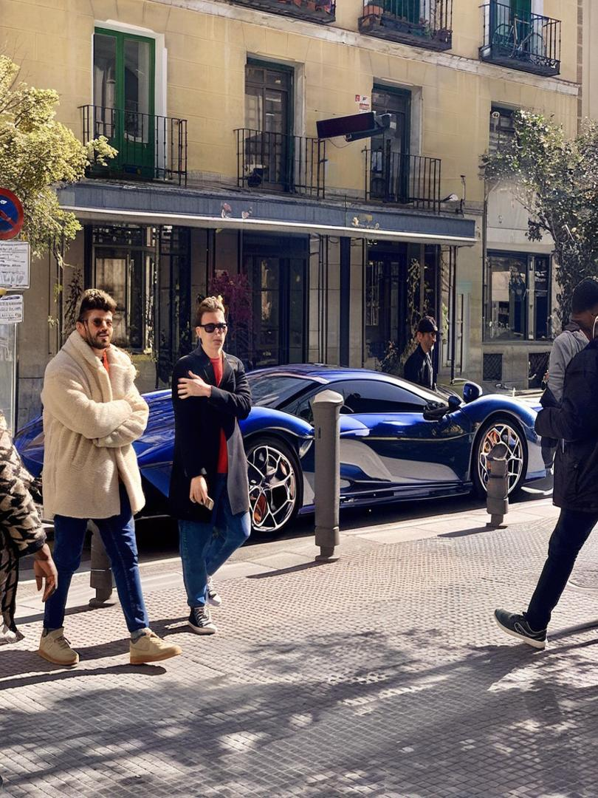
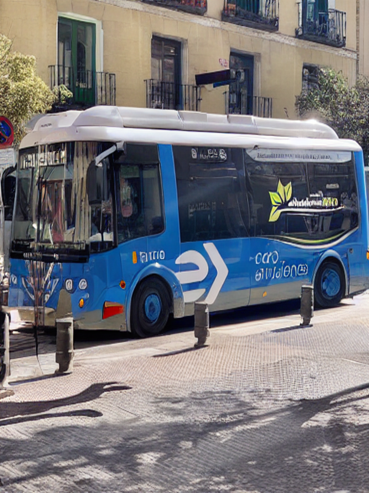
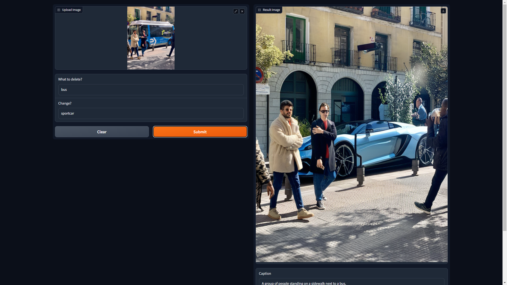

# automatic_image_editor
This is a photo processing application that can automatically find objects and delete them or change them to others.

This application uses:
|Code Name|Usage|Link|
|--|--|--|
|YoloV8|Segmentation with segment names|[Link](https://github.com/ultralytics/ultralytics)|
|Stable Diffusion XL Inpainting|Remove and Replace Object|[Link](https://huggingface.co/diffusers/stable-diffusion-xl-1.0-inpainting-0.1)|
|VIT SWIN Base GPT2 Image Captioning|Сreation of image description|[Link](https://huggingface.co/Abdou/vit-swin-base-224-gpt2-image-captioning)|

**Many thanks to the developer of all models!**
---
Bus images taked from [Yolo repo](https://github.com/ultralytics/ultralytics)

## Exaple Usage

|Original|Raplaced|
|--|--|
|||

```
Promts:
  Remove:Bus
  Replace:Sportcar
```

|Original|Raplaced|
|--|--|
|||
```
Promts:
  Remove:Person
  Replace:
```


## App based on Gradio


## Contributing

Contributions are welcome! If you have suggestions for improving this project, feel free to open an issue or a pull request.

## License

All code provided in this repository is released under the MIT License. Please note that third-party AI models and libraries used may be subject to their own licenses.
